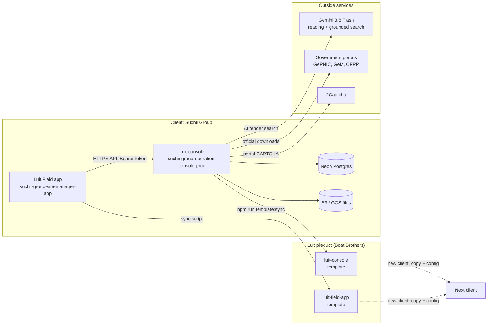
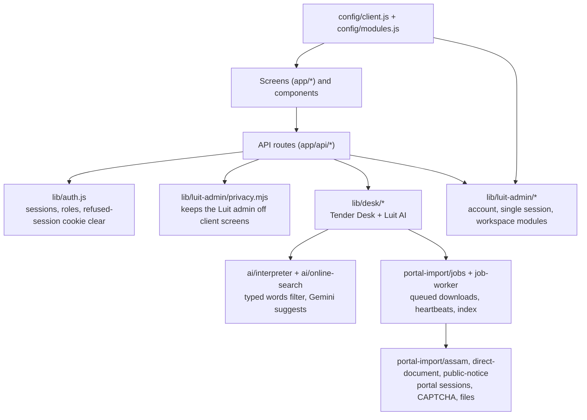

# Luit: product, structure, complexity, and next scope

Status as of 3 October 2026, branch `codex/tender-portal-unified`.

Luit is a construction operating system by Boat Brothers. This repository is the **Suchii Group** deployment of the Luit console. The phone app (Luit Field) lives in `suchii-group-site-manager-app` (branch `luit/field-app`). Client-neutral templates live in the private repos `luit-console` and `luit-field-app`.

## 1. How the pieces fit

Inside the console:

## 2. Size and complexity

Console (non-blank lines, from `git ls-files`):

| Area | Files | Lines |
|---|---:|---:|
| Screens and layouts | 131 | 29,837 |
| API routes | 113 | 10,705 |
| Tender Desk / Luit AI library | 77 | 9,744 |
| UI components | 75 | 9,470 |
| Other server library, config, middleware | 42 | 3,449 |
| Styles | 2 | 1,477 |
| Database schema and migrations | 33 | 1,749 |
| Tests | 44 | 2,189 |
| Scripts and tools | 36 | 4,218 |
| **Total** | **553** | **72,838** |

74 screens, 113 route files with 215 HTTP handlers, about 1,600 functions, about 300 React components, 48 database models (about 760 fields), 32 migrations, 210 automated tests, 11 sellable modules.

Luit Field app (Dart): 73 files, 11,775 lines; 19 screens, about 116 classes, about 284 methods, 12 services.

Rebuilding the console from scratch is roughly 3 to 5 person-years: 10 to 14 months for 3 or 4 senior developers. The hardest parts are official portal retrieval (sessions, CAPTCHA, identity checks), grounded AI search with cost control, the hidden Luit admin privacy layer, and geofenced attendance with the phone app. A new client from the templates is 1 to 3 days of configuration.

## 3. Product and client split

| Concern | Where |
|---|---|
| Client name, logo, email domain, storage default, purchased modules | `config/client.js` (app: `lib/core/config/client_config.dart`) |
| Sellable modules and dependencies | `config/modules.js` |
| Product naming and credit | `lib/branding.js` (app: `lib/core/config/brand.dart`) |
| Luit admin (Boat Brothers platform account) | `lib/luit-admin/` |
| Hidden admin panel | `/luit-admin` (no link anywhere; not-found for others) |

The Luit admin has every module, is never shown on client screens, and has one live session at a time. Module switches (On, Preview, Off), the workspace notice, service health, and an activity log are in the panel.

## 4. Template workflow

Development happens in the client repo. Templates are generated from it and never edited by hand.

1. Commit the change in this repo.
2. Run `npm run template:sync` (rules in `scripts/luit-template.json`).
3. The script checks out that commit in a temporary worktree, drops client data, replaces client names, keeps the template's own config, logo, and README, refuses to finish if a client name remains, and commits only the files that changed as `Sync from suchii-group-operation-console-prod@<sha>`. `.luit-source` records the source commit.
4. Push the template repo.

The app repo has the same flow with `node tools/sync-luit-template.mjs`.

When a second client exists, the direction can flip: the template becomes the upstream product repo and each client repo merges product updates from it. That needs the remaining client-specific strings moved into config first (browser storage keys, test database name, portal user agents).

## 5. What changed in this round

- Luit rename and brand; sidebar grouped by area; page titles match the sidebar; one header style; calm stat tiles; consistent Loading labels.
- Luit AI: typed words filter, Gemini readings become suggestion chips; structured output and Gemini 3 settings; city to state, department, and date-aware reading; location-aware grounded search; downloadable files ranked first; a third grounded query only when needed; readings cached 15 minutes.
- Downloads: tabs and one card per tender; stepper with live worker steps; failure guide with fitting next steps; done summary (files saved, CAPTCHAs solved, time); faster stuck-job detection; portal slot freed before saving; CAPTCHA refunds; no paid work without time to finish; indexed job listing with 30-day cleanup.
- Tender detail: Key dates timeline with countdown.
- EMD: days held from the Loss/Cancel date or bid end; Starts in N days when that date is ahead.
- Saved tenders: Add tender manually from any source, labelled Manually added.
- Profile: bank account number masked.
- Luit admin: hidden panel, module switches, single session, platform account code in one place.
- Performance: one dashboard count query; hidden-account lookups cached 30 seconds.
- Security: refused sessions clear cookies; client code never names the hidden role.
- Phone app: Luit Field brand; shared HTTP client and token cache; token only to the console host; safe link opening; fake GPS refused; console-matched theme.

Verified live on the local app against production: sign-in as the Luit admin, module switch, single session, search with suggestions, and a full official download (Guwahati Municipal Corporation tender 2026_GMC_54217_1: one CAPTCHA, three files, 1 minute 39 seconds) followed by the Key dates view. The Flutter app was not compiled (no Flutter SDK on this machine).

## 6. Next scope

Highest value first.

1. **File storage out of Postgres.** Downloaded tender files are stored as BYTEA in the database. Move them to the existing S3/GCS helpers; keep only keys in the database. Smaller database, faster backups, no 50 MB transactions.
2. **One download per tender across users.** Two people can pay for the same tender's CAPTCHA at once. Add a per-tender lock keyed on the saved-download identity.
3. **Download jobs in a real table.** The partial index fixes listing speed; a `DeskImportJob` table would also remove JSON rewrites on every heartbeat and make history reporting easy.
4. **Background worker outside the request.** Downloads run inside one 300-second function. A queue worker (or a frequent cron pickup) would recover killed jobs instead of marking them interrupted.
5. **Luit admin in its own table.** Move the platform account out of the client's Employee table, with its own sign-in and two-step login; then the privacy layer becomes a safety net, not the main control.
6. **Release safety for the app.** Real release signing key, real application id, `flutter analyze` and device tests in CI.
7. **Security housekeeping.** Revoke the Google Cloud key that was committed on 25 September; rotate the Boat Brothers password and the 2Captcha key that were shared in chat; set `TWOCAPTCHA_API_KEY` in Vercel.
8. **Client-neutral leftovers.** Move browser storage keys, test database name, and portal user agents into config so templates can become the upstream repo.
9. **Production build in CI.** Run `npm run build` and the test suite on every pull request; the local build here was interrupted by the dev server.
10. **Search result cache.** The browser keeps search results for a while, so a server change (for example adding the 2Captcha key) shows only after the cache clears. Include a server capability version in the cache key.
