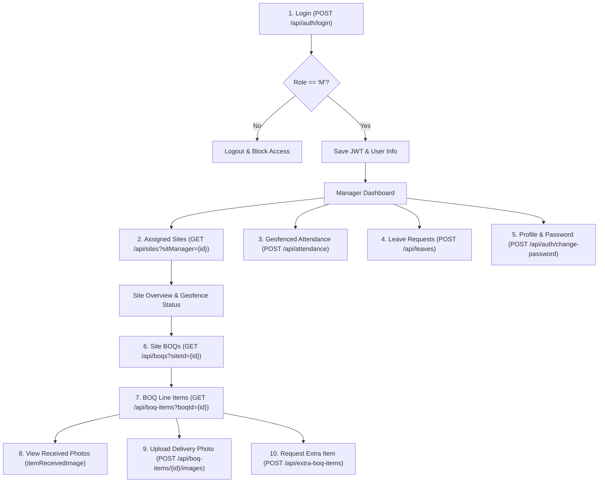

# 📱 Suchii Group — Site Manager Flutter App · Backend Integration Guide

> **Production-grade API integration manual and mobile development specifications for the Suchii Group Flutter mobile application, specifically tailored for Site Managers (`role: 'M'`).**

---

## 1. Executive Summary & Manager App Scope

This document provides the complete backend blueprint for building the **Flutter Site Manager Application**. The backend is an active **Next.js 15 (App Router)** system running on **PostgreSQL (Neon)** with **Prisma ORM** and **Google Cloud Storage (GCS)**.

### Target Persona: Site Manager (`role: 'M'`)
The application is strictly for Site Managers operating in the field. Managers are responsible for:
1. **Secure Authentication** — Logging in with credentials, verifying manager role (`M`), and managing credentials (password change only).
2. **Assigned Sites Directory** — Viewing sites under their operational charge, complete with GPS coordinates and geofence boundaries.
3. **Site Geofenced Attendance** — Checking in/out **strictly within the site geofence radius** (`attendanceRadius` in metres).
4. **Site BOQs & Line Items** — Browsing tender Bill of Quantities (BOQ), line items, quantities, and balances. Tender packs themselves are a separate table (`TenderFile`). An admin adds them at `/boatbrothers/tenders`, and each upload is one row. Managers can read `GET /api/tenders` and `GET /api/tenders/documents`. They cannot upload those files.
5. **Photographic Delivery Verification (`itemReceivedImage`)** — Viewing photo proof of received materials with GPS tags and capturing new delivery verification photos directly from the camera with auto-GPS stamping.
6. **Extra BOQ Item Requests (Variations)** — Submitting line-item variation requests for approval by the head office.
7. **Leave Applications** — Applying for leave and tracking approval status.

---

## 2. API Connection & Base URLs

### 2.1 Base URLs

| Environment | Base URL | Notes |
|---|---|---|
| **Android Emulator** | `http://10.0.2.2:3000/api` | Maps to `localhost:3000` on the host PC |
| **iOS Simulator** | `http://localhost:3000/api` | Direct loopback |
| **Physical Device (LAN)** | `http://<YOUR_LOCAL_IP>:3000/api` | e.g. `http://192.168.1.15:3000/api` |
| **Production (Vercel)** | `https://admin.suchiigroup.com/api` | Deployed backend API domain |

> [!IMPORTANT]
> All endpoints expect `Content-Type: application/json` unless uploading files (`multipart/form-data`).  
> All protected endpoints **require** the header: `Authorization: Bearer <JWT_TOKEN>`.

### 2.2 Standard API Response Envelope

Every backend response follows a unified JSON format:

```json
{
  "success": true,
  "message": "Operation successful",
  "data": { ... },
  "timestamp": "2026-09-26T12:00:00.000Z",
  "pagination": { "total": 100, "page": 1, "limit": 20, "totalPages": 5 }
}
```

- When `success: true`: Extract your payload from `data`.
- When `success: false`: The error message is in `message` or `errors`.
- `BigInt` values (`phone`, `aadhar`, `emergencyNo`) are returned as **strings**. Parse them as `String` in Dart, never `int`.

---

## 3. Recommended Flutter Dependencies

Add the following to your `pubspec.yaml`:

```yaml
dependencies:
  flutter:
    sdk: flutter
  
  # Networking & Auth
  dio: ^5.7.0
  flutter_secure_storage: ^9.2.2
  
  # Location & Geofencing
  geolocator: ^13.0.1
  
  # Media & Photo Capture
  image_picker: ^1.1.2
  cached_network_image: ^3.4.1
  
  # State Management & Utils
  flutter_riverpod: ^2.6.1   # or provider / flutter_bloc
  intl: ^0.19.0
```

---

## 4. Module Specifications & Endpoints



---

### Module 1: Authentication & Session Management

#### 1.1 Login
- **Endpoint**: `POST /api/auth/login`
- **Access**: Public
- **Request Body**:
```json
{
  "email": "manager@suchiigroup.com",
  "password": "Password123"
}
```

- **Success Response (`200 OK`)**:
```json
{
  "success": true,
  "message": "Login successful",
  "data": {
    "token": "eyJhbGciOiJIUzI1NiIsInR5cCI6IkpXVCJ9...",
    "user": {
      "id": "c7a8e52a-9e3d-4c3e-8e5f-123456789abc",
      "name": "Rajesh Kumar",
      "email": "manager@suchiigroup.com",
      "phone": "9876543210",
      "role": "M",
      "employeeCode": "EMP-042",
      "profileImageUrl": "/api/files/employee-profiles/rajesh.jpg",
      "designation": { "title": "Senior Site Manager" },
      "department": { "name": "Civil Construction" },
      "firm": { "name": "Suchii Infra Ltd" }
    }
  }
}
```

> [!CAUTION]
> **Role Check Enforcement**: After successful response, verify `data.user.role == 'M'`. If the user is role `'E'` or anything else, log them out immediately with an alert: *"Access restricted to Site Managers only."*

- **Session Duration**: The token is valid for **12 hours**. Store the token in `FlutterSecureStorage`. Configure a Dio interceptor to handle `401 Unauthorized` by clearing storage and redirecting to the Login screen.

---

### Module 2: Profile & Password Management

Managers can view their profile and **update their password only**. Profile details (name, email, KYC) are read-only and maintained by HR.

#### 2.1 Get Current Profile
- **Endpoint**: `GET /api/auth/me`
- **Headers**: `Authorization: Bearer <token>`
- **Response**:
```json
{
  "success": true,
  "employee": {
    "id": "c7a8e52a-9e3d-4c3e-8e5f-123456789abc",
    "name": "Rajesh Kumar",
    "email": "manager@suchiigroup.com",
    "phone": "9876543210",
    "role": "M",
    "employeeCode": "EMP-042",
    "gender": "MALE",
    "profileImageUrl": "/api/files/employee-profiles/...",
    "designation": { "id": "...", "title": "Senior Site Manager" },
    "department": { "id": "...", "name": "Civil Construction" },
    "firm": { "id": "...", "name": "Suchii Infra Ltd" }
  }
}
```

#### 2.2 Change Password
- **Endpoint**: `POST /api/auth/change-password`
- **Headers**: `Authorization: Bearer <token>`
- **Request Body**:
```json
{
  "currentPassword": "OldPassword123",
  "newPassword": "NewStrongPassword456!",
  "confirmPassword": "NewStrongPassword456!"
}
```

- **Validation Rules**:
  - `newPassword` and `confirmPassword` must match identically.
  - `newPassword` must be **at least 8 characters long**.
  - `newPassword` must be **different** from `currentPassword`.

- **Success Response (`200 OK`)**:
```json
{
  "success": true,
  "message": "Password changed successfully."
}
```

---

### Module 3: Assigned Sites Directory

Site Managers only work with sites assigned to them.

#### 3.1 Fetch Assigned Sites
- **Endpoint**: `GET /api/sites?sitManager={managerId}&dropdown=true`
- **Headers**: `Authorization: Bearer <token>`
- **Query Parameters**:
  - `sitManager`: Current manager's `user.id`.
  - `dropdown=true`: Returns the full list without pagination.

- **Success Response (`200 OK`)**:
```json
{
  "success": true,
  "message": "Sites retrieved successfully",
  "data": [
    {
      "id": "site-uuid-101",
      "name": "Guwahati Smart City Bridge - Site A",
      "address": "Brahmaputra Bank, Sector 4, Guwahati",
      "coordinates": "26.1824, 91.7516",
      "attendanceRadius": 250,
      "status": "ACTIVE",
      "sitManager": "c7a8e52a-9e3d-4c3e-8e5f-123456789abc",
      "projectId": "proj-uuid-201",
      "project": {
        "id": "proj-uuid-201",
        "name": "Smart City Riverfront Project",
        "tenderId": "TND-2026-089",
        "status": "IN_PROGRESS",
        "budget": 45000000.0
      }
    }
  ]
}
```

#### 3.2 Coordinate & Radius Parsing
- `coordinates`: Format is `"latitude, longitude"` (e.g. `"26.1824, 91.7516"`). Parse this string into two `double` values.
- `attendanceRadius`: Integer representing the geofence perimeter in **metres** (e.g. `250`). If `null`, no geofence radius limit is enforced.

---

### Module 4: Geofenced Site Attendance (Crucial Feature)

> [!IMPORTANT]
> **Strict Geofence Rule**: The Site Manager is **only allowed to mark check-in if their current GPS location is inside the assigned site's `attendanceRadius`**.

#### 4.1 Mobile Workflow & Client-Side Verification

1. The manager selects an assigned site on the app.
2. The app requests high-accuracy GPS coordinates via Flutter's `geolocator`:
   ```dart
   Position position = await Geolocator.getCurrentPosition(
     desiredAccuracy: LocationAccuracy.high,
   );
   ```
3. Parse the site's coordinates:
   ```dart
   final parts = site.coordinates.split(',').map((e) => double.parse(e.trim())).toList();
   final siteLat = parts[0];
   final siteLng = parts[1];
   ```
4. Calculate straight-line distance in metres using `geolocator`:
   ```dart
   double distanceInMetres = Geolocator.distanceBetween(
     siteLat,
     siteLng,
     position.latitude,
     position.longitude,
   );
   ```
5. **Geofence Enforcement**:
   - If `site.attendanceRadius != null` and `distanceInMetres > site.attendanceRadius`:
     - **Disable the Check-In button** in the UI.
     - Display a prominent red warning card:
       > ⚠️ **Outside Geofence Perimeter**  
       > You are **${distanceInMetres.toStringAsFixed(1)}m** away from the site.  
       > Maximum allowed distance is **${site.attendanceRadius}m**.
   - If `distanceInMetres <= site.attendanceRadius`:
     - Enable the Check-In button with a green badge:
       > ✅ **Within Site Perimeter (${distanceInMetres.toStringAsFixed(1)}m away)**.

#### 4.2 Check-In API Call
- **Endpoint**: `POST /api/attendance`
- **Headers**: `Authorization: Bearer <token>`
- **Request Body**:
```json
{
  "employeeId": "c7a8e52a-9e3d-4c3e-8e5f-123456789abc",
  "siteId": "site-uuid-101",
  "checkInLat": 26.182510,
  "checkInLng": 91.751720,
  "method": "GPS",
  "gpsAccuracy": 4.2
}
```

- **Backend Automated Validation**:
  - The server computes the distance using the **Haversine formula**.
  - Stores a snapshot of `siteLat`, `siteLng`, and `siteAttendanceRadius`.
  - Automatically records `distanceFromSite` and computes `locationRemarks`:
    - `"Within radius. Distance: 15.3m (limit: 250m)."`

- **Success Response (`201 Created`)**:
```json
{
  "success": true,
  "message": "Employee \"Rajesh Kumar\" checked in successfully.",
  "data": {
    "id": "att-uuid-501",
    "employeeId": "c7a8e52a-9e3d-4c3e-8e5f-123456789abc",
    "siteId": "site-uuid-101",
    "checkInTime": "2026-09-26T08:30:00.000Z",
    "checkOutTime": null,
    "method": "GPS",
    "gpsAccuracy": 4.2,
    "siteLat": 26.1824,
    "siteLng": 91.7516,
    "siteAttendanceRadius": 250,
    "checkInLat": 26.18251,
    "checkInLng": 91.75172,
    "distanceFromSite": 15.3,
    "locationRemarks": "Within radius. Distance: 15.3m (limit: 250m)."
  }
}
```

#### 4.3 Check-Out API Call
- **Endpoint**: `POST /api/attendance`
- **Headers**: `Authorization: Bearer <token>`
- **Request Body**:
```json
{
  "action": "checkOut",
  "employeeId": "c7a8e52a-9e3d-4c3e-8e5f-123456789abc",
  "siteId": "site-uuid-101",
  "method": "GPS",
  "gpsAccuracy": 3.8
}
```

- **Success Response (`200 OK`)**:
```json
{
  "success": true,
  "message": "Employee \"Rajesh Kumar\" checked out successfully.",
  "data": {
    "id": "att-uuid-501",
    "checkInTime": "2026-09-26T08:30:00.000Z",
    "checkOutTime": "2026-09-26T17:30:00.000Z"
  }
}
```

#### 4.4 Get Today's Shift Status
- **Endpoint**: `GET /api/attendance?employeeId={managerId}&date={YYYY-MM-DD}`
- Use this to check whether the manager is currently checked in (record with `checkOutTime == null`).

---

### Module 5: Site BOQs & Line Items

#### 5.1 Fetch BOQ for a Site
- **Endpoint**: `GET /api/boqs?siteId={siteId}&limit=all`
- **Headers**: `Authorization: Bearer <token>`
- **Response**:
```json
{
  "success": true,
  "message": "BOQs retrieved successfully",
  "data": [
    {
      "id": "boq-uuid-301",
      "boqCode": "BOQ-SMARTCITY-01",
      "projectId": "proj-uuid-201",
      "siteId": "site-uuid-101",
      "validity": "2027-03-31T00:00:00.000Z",
      "docsLinks": ["/api/files/boq-files/tender-spec.pdf"],
      "project": { "id": "proj-uuid-201", "name": "Smart City Riverfront Project" }
    }
  ]
}
```

#### 5.2 Fetch BOQ Line Items
- **Endpoint**: `GET /api/boq-items?boqId={boqId}&limit=all`
- **Headers**: `Authorization: Bearer <token>`
- **Response**:
```json
{
  "success": true,
  "message": "BOQ items retrieved",
  "data": [
    {
      "id": "item-uuid-401",
      "boqId": "boq-uuid-301",
      "slNo": "1.01",
      "itemName": "Reinforced Cement Concrete M25 Grade",
      "specification": "IS 456-2000 compliant with 20mm graded aggregate",
      "unit": "CUM",
      "quantity": "500",
      "rate": 6500.0,
      "amount": 3250000.0,
      "itemReceivedTotalQuantity": "200",
      "itemLeft": "300",
      "itemReceivedImage": [
        {
          "slNo": 1,
          "imageLink": "/api/files/boq-received-images/item-uuid-401/batch-01.jpg",
          "lat": 26.1825,
          "long": 91.7518,
          "createdAt": "2026-09-25T11:20:00.000Z",
          "createdBy": "c7a8e52a-9e3d-4c3e-8e5f-123456789abc"
        }
      ],
      "remarks": "Pouring Phase 1 completed"
    }
  ]
}
```

---

### Module 6: Photographic Delivery Verification (`itemReceivedImage`)

In `BOQItems`, the `itemReceivedImage` column is a **JSON field** that stores an array of photo objects documenting delivered materials:

#### 6.1 `itemReceivedImage` JSON Schema

```json
[
  {
    "slNo": 1,
    "imageLink": "/api/files/boq-received-images/item-uuid-401/photo-uuid.jpg",
    "lat": 26.182510,
    "long": 91.751720,
    "createdAt": "2026-09-26T10:15:30.000Z",
    "createdBy": "c7a8e52a-9e3d-4c3e-8e5f-123456789abc"
  }
]
```

| Property | Type | Description |
|---|---|---|
| `slNo` | `int` or `string` | Serial number of the photo delivery batch (e.g. 1, 2, 3) |
| `imageLink` | `string` | Backend proxy URL (e.g. `/api/files/...`) pointing to private GCS file |
| `lat` | `double?` | GPS latitude where the photo was captured |
| `long` | `double?` | GPS longitude where the photo was captured |
| `createdAt` | `string` | ISO 8601 timestamp of upload |
| `createdBy` | `string?` | User ID of the uploader |

#### 6.2 Displaying Images in Flutter
Because the backend storage bucket is private, images are served via the proxy route `/api/files/...` with JWT authentication.

To load images in Flutter using `cached_network_image`:
```dart
String getFullImageUrl(String baseApiUrl, String imageLink) {
  // If baseApiUrl is "https://admin.suchiigroup.com/api"
  final host = baseApiUrl.endsWith('/api') 
      ? baseApiUrl.substring(0, baseApiUrl.length - 4) 
      : baseApiUrl;
  return '$host$imageLink';
}

Widget buildDeliveryPhoto(String fullUrl, String jwtToken) {
  return CachedNetworkImage(
    imageUrl: fullUrl,
    httpHeaders: {
      'Authorization': 'Bearer $jwtToken',
    },
    placeholder: (context, url) => const CircularProgressIndicator(),
    errorWidget: (context, url, error) => const Icon(Icons.broken_image),
  );
}
```

#### 6.3 Uploading a New Delivery Photo
When goods arrive at the job site, the Manager takes a photo with the camera. The app fetches the current GPS coordinates and uploads the image.

- **Endpoint**: `POST /api/boq-items/{id}/images`
- **Headers**:
  - `Authorization: Bearer <token>`
  - `Content-Type: multipart/form-data`
- **Multipart Form Data**:

| Field Name | Type | Description |
|---|---|---|
| `file` | Binary (File) | Image file (`.jpg`, `.jpeg`, `.png`, `.webp`), max 10MB |
| `lat` | `double` | Current GPS latitude from device |
| `long` | `double` | Current GPS longitude from device |
| `slNo` | `int` or `string` | Serial number (optional, defaults to next sequential index) |

- **Success Response (`201 Created`)**:
```json
{
  "success": true,
  "message": "Received delivery photo uploaded to storage and linked to BOQ item successfully.",
  "data": {
    "boqItemId": "item-uuid-401",
    "newEntry": {
      "slNo": 2,
      "imageLink": "/api/files/boq-received-images/item-uuid-401/f9a8...jpg",
      "lat": 26.18251,
      "long": 91.75172,
      "createdAt": "2026-09-26T12:30:00.000Z",
      "createdBy": "c7a8e52a-9e3d-4c3e-8e5f-123456789abc"
    },
    "images": [ ... ]
  }
}
```

---

### Module 7: Request Extra BOQ Items (Variations)

When on-site conditions require materials or quantities outside the approved BOQ line item, the Manager submits an **Extra BOQ Item Request** (`ExtraItemBOQ`).

#### 7.1 Submit Extra BOQ Item Request
- **Endpoint**: `POST /api/extra-boq-items`
- **Headers**: `Authorization: Bearer <token>`
- **Request Body**:
```json
{
  "boqItemId": "item-uuid-401",
  "itemName": "Extra M25 Concrete for Foundation Extension",
  "itemQuantity": "40 CUM",
  "requestedBy": "Rajesh Kumar (Site Manager)",
  "remarks": "Soil depth at Pier 3 required deeper footing than original drawings."
}
```

- **Success Response (`201 Created`)**:
```json
{
  "success": true,
  "message": "Extra BOQ item created successfully.",
  "data": {
    "id": "extra-uuid-601",
    "boqItemId": "item-uuid-401",
    "itemName": "Extra M25 Concrete for Foundation Extension",
    "itemQuantity": "40 CUM",
    "isApproved": false,
    "approvedBy": null,
    "requestedBy": "Rajesh Kumar (Site Manager)",
    "remarks": "Soil depth at Pier 3 required deeper footing than original drawings.",
    "createdAt": "2026-09-26T12:45:00.000Z"
  }
}
```

#### 7.2 View Variations for a BOQ Line Item
- **Endpoint**: `GET /api/extra-boq-items?boqItemId={boqItemId}`
- **Headers**: `Authorization: Bearer <token>`
- Displays status badge: `isApproved == true` (Approved) vs `isApproved == false` (Pending Approval).

---

### Module 8: Leave Applications

Managers can submit personal leave requests and track previous requests.

#### 8.1 Apply for Leave
- **Endpoint**: `POST /api/leaves`
- **Headers**: `Authorization: Bearer <token>`
- **Request Body**:
```json
{
  "reason": "Attending family medical appointment",
  "leaveDate": "2026-09-30T00:00:00.000Z",
  "duration": 1.0
}
```
*(For a half-day leave, send `"duration": 0.5`)*.

- **Success Response (`201 Created`)**:
```json
{
  "success": true,
  "message": "Leave request submitted successfully.",
  "data": {
    "id": "leave-uuid-701",
    "employeeId": "c7a8e52a-9e3d-4c3e-8e5f-123456789abc",
    "reason": "Attending family medical appointment",
    "leaveDate": "2026-09-30T00:00:00.000Z",
    "duration": 1.0,
    "approved": null
  }
}
```

#### 8.2 Get Own Leave History
- **Endpoint**: `GET /api/leaves?employeeId={managerId}`
- **Status Mapping**:
  - `approved: null` ➔ 🟡 **Pending Review**
  - `approved: true` ➔ 🟢 **Approved**
  - `approved: false` ➔ 🔴 **Rejected**

---

## 5. Production-Ready Dart Code Examples

### 5.1 Geofence Service (`geofence_service.dart`)

```dart
import 'package:geolocator/geolocator.dart';

class GeofenceResult {
  final bool isWithinGeofence;
  final double distanceInMetres;
  final double? allowedRadius;
  final Position userPosition;

  GeofenceResult({
    required this.isWithinGeofence,
    required this.distanceInMetres,
    this.allowedRadius,
    required this.userPosition,
  });
}

class GeofenceService {
  /// Evaluates whether the manager is within the site's attendance radius.
  static Future<GeofenceResult> verifySiteProximity({
    required String siteCoordinates,
    required int? siteAttendanceRadius,
  }) async {
    // 1. Check & Request Location Permission
    bool serviceEnabled = await Geolocator.isLocationServiceEnabled();
    if (!serviceEnabled) {
      throw Exception('GPS is disabled. Please turn on device location services.');
    }

    LocationPermission permission = await Geolocator.checkPermission();
    if (permission == LocationPermission.denied) {
      permission = await Geolocator.requestPermission();
      if (permission == LocationPermission.denied) {
        throw Exception('Location permissions are denied.');
      }
    }

    if (permission == LocationPermission.deniedForever) {
      throw Exception('Location permissions are permanently denied. Please enable them in app settings.');
    }

    // 2. Fetch High-Accuracy Current GPS Position
    Position currentPos = await Geolocator.getCurrentPosition(
      desiredAccuracy: LocationAccuracy.high,
    );

    // 3. Parse Site Coordinates ("lat, lng")
    final parts = siteCoordinates.split(',').map((e) => double.tryParse(e.trim())).toList();
    if (parts.length != 2 || parts[0] == null || parts[1] == null) {
      throw Exception('Site has invalid GPS coordinates configured.');
    }

    final siteLat = parts[0]!;
    final siteLng = parts[1]!;

    // 4. Compute Distance
    double distance = Geolocator.distanceBetween(
      siteLat,
      siteLng,
      currentPos.latitude,
      currentPos.longitude,
    );

    // 5. Compare with attendance radius
    bool within = true;
    if (siteAttendanceRadius != null && siteAttendanceRadius > 0) {
      within = distance <= siteAttendanceRadius;
    }

    return GeofenceResult(
      isWithinGeofence: within,
      distanceInMetres: distance,
      allowedRadius: siteAttendanceRadius?.toDouble(),
      userPosition: currentPos,
    );
  }
}
```

---

### 5.2 Api Service (`api_service.dart`)

```dart
import 'dart:io';
import 'package:dio/dio.dart';
import 'package:flutter_secure_storage/flutter_secure_storage.dart';

class ApiService {
  static const String baseUrl = 'http://10.0.2.2:3000/api'; // Or production URL
  final Dio _dio = Dio(BaseOptions(baseUrl: baseUrl, connectTimeout: const Duration(seconds: 15)));
  final FlutterSecureStorage _storage = const FlutterSecureStorage();

  ApiService() {
    _dio.interceptors.add(
      InterceptorsWrapper(
        onRequest: (options, handler) async {
          final token = await _storage.read(key: 'jwt_token');
          if (token != null) {
            options.headers['Authorization'] = 'Bearer $token';
          }
          return handler.next(options);
        },
        onError: (DioException error, handler) async {
          if (error.response?.statusCode == 401) {
            // Token expired (12h TTL) -> Handle logout
            await _storage.deleteAll();
          }
          return handler.next(error);
        },
      ),
    );
  }

  // 1. Login
  Future<Map<String, dynamic>> login(String email, String password) async {
    final response = await _dio.post('/auth/login', data: {
      'email': email,
      'password': password,
    });
    return response.data;
  }

  // 2. Change Password Only
  Future<void> changePassword({
    required String currentPassword,
    required String newPassword,
    required String confirmPassword,
  }) async {
    await _dio.post('/auth/change-password', data: {
      'currentPassword': currentPassword,
      'newPassword': newPassword,
      'confirmPassword': confirmPassword,
    });
  }

  // 3. Get Assigned Sites
  Future<List<dynamic>> getAssignedSites(String managerId) async {
    final response = await _dio.get('/sites', queryParameters: {
      'sitManager': managerId,
      'dropdown': 'true',
    });
    return response.data['data'];
  }

  // 4. Punch Geofenced Attendance
  Future<Map<String, dynamic>> checkIn({
    required String employeeId,
    required String siteId,
    required double latitude,
    required double longitude,
    required double accuracy,
  }) async {
    final response = await _dio.post('/attendance', data: {
      'employeeId': employeeId,
      'siteId': siteId,
      'checkInLat': latitude,
      'checkInLng': longitude,
      'method': 'GPS',
      'gpsAccuracy': accuracy,
    });
    return response.data['data'];
  }

  // 5. Upload BOQ Item Delivery Photo
  Future<Map<String, dynamic>> uploadDeliveryPhoto({
    required String boqItemId,
    required File imageFile,
    required double latitude,
    required double longitude,
    int? slNo,
  }) async {
    String fileName = imageFile.path.split('/').last;
    FormData formData = FormData.fromMap({
      'file': await MultipartFile.fromFile(imageFile.path, filename: fileName),
      'lat': latitude,
      'long': longitude,
      if (slNo != null) 'slNo': slNo,
    });

    final response = await _dio.post(
      '/boq-items/$boqItemId/images',
      data: formData,
    );
    return response.data['data'];
  }

  // 6. Request Extra BOQ Item
  Future<void> requestExtraBOQItem({
    required String boqItemId,
    required String itemName,
    required String itemQuantity,
    required String requestedBy,
    String? remarks,
  }) async {
    await _dio.post('/extra-boq-items', data: {
      'boqItemId': boqItemId,
      'itemName': itemName,
      'itemQuantity': itemQuantity,
      'requestedBy': requestedBy,
      'remarks': remarks,
    });
  }

  // 7. Apply for Leave
  Future<void> applyLeave({
    required String reason,
    required DateTime leaveDate,
    double duration = 1.0,
  }) async {
    await _dio.post('/leaves', data: {
      'reason': reason,
      'leaveDate': leaveDate.toIso8601String(),
      'duration': duration,
    });
  }
}
```

---

## 6. Mobile Platform Configuration

### 6.1 Android Setup (`android/app/src/main/AndroidManifest.xml`)

Add fine and coarse location permissions inside the `<manifest>` tag:

```xml
<manifest xmlns:android="http://schemas.android.com/apk/res/android">
    <!-- GPS & Geofencing Permissions -->
    <uses-permission android:name="android.permission.ACCESS_FINE_LOCATION" />
    <uses-permission android:name="android.permission.ACCESS_COARSE_LOCATION" />
    
    <!-- Camera for delivery photos -->
    <uses-permission android:name="android.permission.CAMERA" />
    
    <!-- Network access -->
    <uses-permission android:name="android.permission.INTERNET" />
    ...
</manifest>
```

> If testing on HTTP (local IP or 10.0.2.2), ensure `android:usesCleartextTraffic="true"` is added to `<application>` in debug mode.

### 6.2 iOS Setup (`ios/Runner/Info.plist`)

Add the following keys to `Info.plist`:

```xml
<key>NSLocationWhenInUseUsageDescription</key>
<string>We need your GPS location to verify that you are physically present at the construction site for attendance check-in.</string>

<key>NSCameraUsageDescription</key>
<string>We need camera access to capture material delivery proof photos with GPS verification.</string>

<key>NSPhotoLibraryUsageDescription</key>
<string>We need photo library access to upload site delivery receipts.</string>
```

---

## 7. Mobile QA Checklist for Site Manager App

| Test Case | Expected Behavior |
|---|---|
| **Non-Manager Login** | User with role `E` (Employee) logs in ➔ App detects `role != 'M'` and immediately kicks out with error dialog. |
| **Inside Geofence Punch** | Manager is within 150m of a 250m radius site ➔ Green proximity badge displayed, Check-In button enabled, punch succeeds with `Within radius` remark. |
| **Outside Geofence Punch** | Manager is 600m away from site ➔ Red warning banner shown, Check-In button **disabled**; user cannot submit punch. |
| **Delivery Photo Capture** | Taking photo from camera on BOQ Line Item ➔ Device captures current GPS coords and successfully uploads multipart form to `/api/boq-items/{id}/images`. |
| **Gallery Inspection** | Viewing `itemReceivedImage` ➔ App parses JSON array, attaches Bearer token header, and displays photos with timestamps and lat/long overlays. |
| **Extra BOQ Variation** | Manager fills item name and quantity ➔ Created with `isApproved: false`. Shows "Pending" chip until head office approves. |
| **Change Password** | Manager enters old password and new 8+ char password ➔ Updated successfully. Next login uses new credentials. |
| **12-Hour Session Expiry** | App opened after 13 hours ➔ 401 error intercepted, secure storage cleared, manager redirected to Login screen. |

---

*Manual maintained for Suchii Group Flutter Mobile Engineering. Reference backend: Next.js 15 + Prisma 6.4 + PostgreSQL.*
